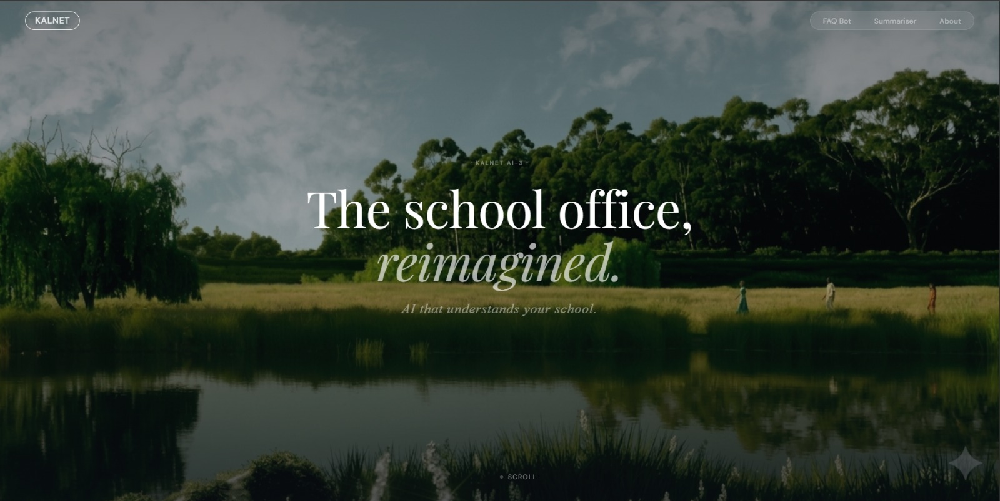
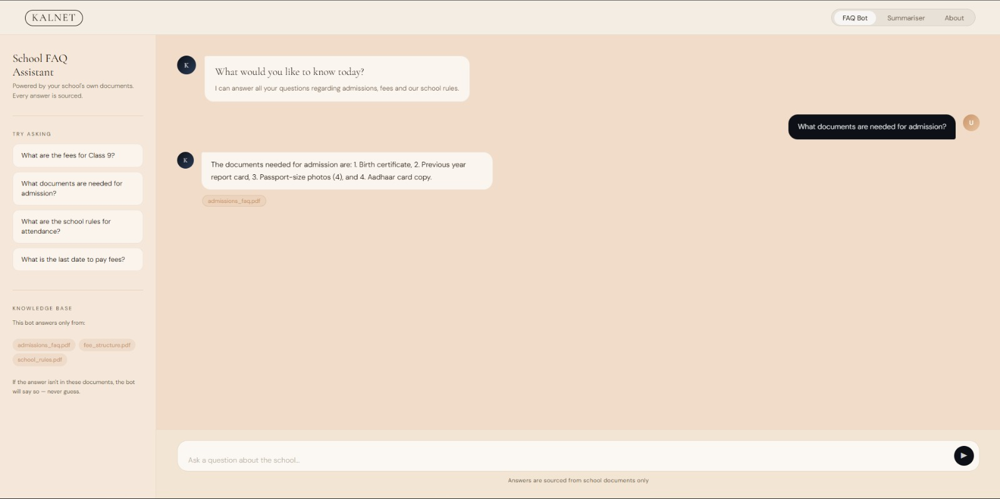
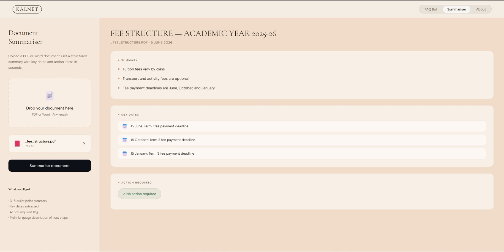

# 🎓 KALNET AI Suite

<div align="center">


### AI-Powered School Information & Document Intelligence Platform

*Retrieval-Augmented Generation (RAG) Chatbot + AI Document Summarisation*

[🚀 Live Demo](https://YOUR-RENDER-URL.onrender.com)

</div>

---

# 📌 Overview

KALNET AI Suite is an AI-powered educational assistant designed to help students, parents, and school administrators quickly access information from institutional documents.

The platform combines:

* 🤖 AI FAQ Chatbot
* 📄 Intelligent Document Summariser
* 🔍 Semantic Search using Vector Embeddings
* ⚡ FastAPI Backend
* 🎨 Modern Responsive Frontend
* ☁️ Cloud Deployment via Render

Instead of manually searching through lengthy PDFs, users can ask natural language questions and receive contextual AI-generated answers backed by institutional knowledge.

---

# 🚀 Live Demo

### Application

https://YOUR-RENDER-URL.onrender.com

### Pages

| Feature             | URL          |
| ------------------- | ------------ |
| Landing Page        | `/`          |
| AI FAQ Chatbot      | `/chat`      |
| Document Summariser | `/summarise` |

---

# ✨ Project Highlights

### AI & Machine Learning

* Built a Retrieval-Augmented Generation (RAG) system using LangChain and FAISS.
* Integrated Google Gemini 1.5 Flash for contextual response generation.
* Implemented semantic document retrieval using vector embeddings.

### Software Engineering

* Developed a modular FastAPI backend architecture.
* Created a multi-page web interface for chatbot and document analysis workflows.
* Designed reusable AI agent architecture for scalability.

### Real-World Impact

* Enables instant access to institutional knowledge.
* Reduces time spent searching through administrative documents.
* Simplifies communication between schools, students, and parents.

---

# ✨ Features

## 🤖 AI FAQ Chatbot

Ask questions such as:

* What is the admission process?
* What are the school timings?
* What are the fee details?
* Which documents are required for enrollment?

### Capabilities

✅ Retrieval-Augmented Generation (RAG)

✅ Context-aware responses

✅ Semantic document search

✅ Institutional knowledge retrieval

✅ Source-backed answers

---

## 📄 AI Document Summariser

Upload PDF or DOCX files and receive:

* Executive Summary
* Key Highlights
* Important Dates
* Action Items
* Important Announcements

### Supported Formats

* PDF
* DOCX

---

## 🎨 Modern Frontend

* Responsive design
* Landing page navigation
* Interactive chatbot interface
* File upload experience
* Clean user experience

---

# 🏗️ System Architecture

```text
School Documents
       │
       ▼
Document Processing
       │
       ▼
Text Chunking
       │
       ▼
Sentence Transformers
       │
       ▼
FAISS Vector Store
       │
       ▼
Retriever
       │
       ▼
Gemini 1.5 Flash
       │
       ▼
AI Response
```

---

# 🛠️ Tech Stack

## Backend

* FastAPI
* Uvicorn
* Python

## AI & NLP

* Google Gemini 1.5 Flash
* LangChain
* Sentence Transformers

## Vector Search

* FAISS

## Document Processing

* PyMuPDF
* python-docx

## Frontend

* HTML5
* CSS3
* JavaScript

## Deployment

* Render

---

# 📂 Project Structure

```text
AI3_FaqChatbot
│
├── agents/
│   ├── base.py
│   ├── faq_bot.py
│   ├── doc_summariser.py
│   └── vector_store.py
│
├── api/
│   └── main.py
│
├── data/
│   ├── raw/
│   ├── processed/
│   └── pipeline/
│
├── docs/
│   ├── screenshots/
│   └── demo/
│
├── templates/
│   ├── landing.html
│   ├── chat.html
│   └── summarise.html
│
├── tests/
│
├── requirements.txt
├── README.md
└── .env.example
```

---

# 📸 Application Screenshots

## 🏠 Landing Page



---

## 🤖 AI FAQ Chatbot



---

## 📄 Document Summariser



---

# 🎥 Demo

## Complete Workflow


### Demonstrates

* Landing page navigation
* AI chatbot interaction
* Semantic document retrieval
* PDF upload
* AI-powered summarisation

---

# ⚙️ Installation

## Clone Repository

```bash
git clone https://github.com/adityalenka779/AI3_FaqChatbot.git
cd AI3_FaqChatbot
```

---

## Create Virtual Environment

```bash
python -m venv kalvenv
```

### Windows

```bash
kalvenv\Scripts\activate
```

### Linux/macOS

```bash
source kalvenv/bin/activate
```

---

## Install Dependencies

```bash
pip install -r requirements.txt
```

---

# 🔑 Environment Variables

Create a `.env` file:

```env
GEMINI_API_KEY=your_api_key_here
```

---

# 📚 Building the Knowledge Base

Place institutional documents inside:

```text
data/raw/
```

Then build the vector database:

```bash
python data/pipeline/build_kb.py
```

---

# ▶️ Running Locally

```bash
uvicorn api.main:app --reload
```

Open:

```text
http://localhost:8000
```

---

# ☁️ Render Deployment

## Build Command

```bash
pip install -r requirements.txt
```

## Start Command

```bash
uvicorn api.main:app --host 0.0.0.0 --port $PORT
```

## Required Environment Variables

```text
GEMINI_API_KEY
```

Configure these in the Render Dashboard under:

**Environment → Environment Variables**

---

# 🔌 API Endpoints

## Health Check

```http
GET /
```

---

## FAQ Chatbot

```http
POST /ai/faq
```

### Request

```json
{
  "question": "What is the admission process?"
}
```

---

## Document Summariser

```http
POST /ai/summarise
```

Upload:

* PDF
* DOCX

Returns:

* Summary
* Key Highlights
* Important Information

---

# 🎯 Why This Project Matters

Educational institutions store critical information across multiple documents.

Traditional search methods are:

❌ Slow

❌ Manual

❌ Difficult to navigate

KALNET solves this by providing:

✅ Natural Language Search

✅ AI-Powered Summaries

✅ Centralized Knowledge Access

✅ Instant Responses

---

# 🔮 Future Enhancements

* Multi-document conversational memory
* Source citation highlighting
* User authentication
* Role-based access control
* Analytics dashboard
* Voice-enabled assistant
* Cloud storage integration

---

# 👨‍💻 Contributors

* Aditya Lenka
* Priyanshu Sinha
* Aashrith Vathsal
* Chirag Jain
* Bollam Ankith

---

# ⭐ Support

If you found this project useful, please consider giving it a star.

It helps others discover the project and supports future development.

---

<div align="center">

### Built with FastAPI, LangChain, FAISS, and Gemini AI

⭐ Star the repository if you found it useful!

</div>

